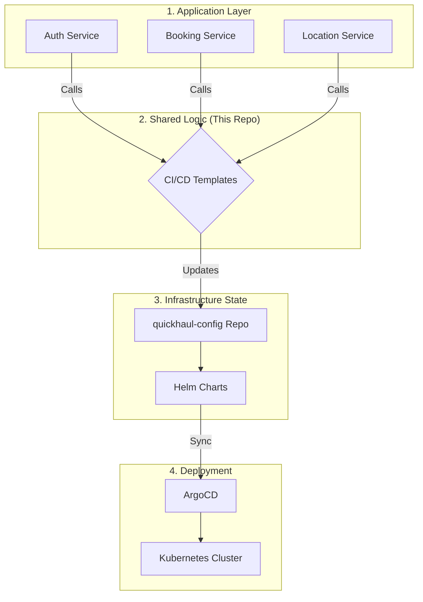

# 🚚 QuickHaul: Enterprise GitOps & CI/CD Framework


Welcome to the **QuickHaul Templates** repository—the engineering heart of the QuickHaul logistics ecosystem. This repository serves as a centralized, high-performance "Workflow Engine" that powers Continuous Integration and GitOps-driven Deployment for our entire microservices fleet.

---

## ✨ Key Features

-   🛡️ **Security-First CI**: Automated SAST (SonarQube), SCA (Snyk), and Image Scanning (Trivy).
-   🎡 **GitOps Engine**: Native integration with ArgoCD and Helm for declarative deployments.
-   🚀 **Zero-Downtime**: Support for Argo Rollouts (Blue-Green/Canary) in Production.
-   📦 **GHCR Integrated**: Optimized for GitHub Container Registry with secret-less OIDC/Token auth.
-   📢 **Smart Alerts**: Real-time vulnerability notifications via Brevo Email API.

---

## 🏗️ System Architecture

Our architecture decouples **Application Logic** from **Infrastructure State**, using this repository as the bridge.



---

## 📂 The Repository Map

| Category | Repository | Role |
| :--- | :--- | :--- |
| **Logic** | [**quickhaul-templates**](https://github.com/QuickHaulTransits/quickhaul-templates) | (Current) Centralized CI/CD YAMLs. |
| **State** | [**quickhaul-config**](https://github.com/QuickHaulTransits/quickhaul-config) | GitOps manifests & Helm Charts. |
| **Services** | [**auth-service**](https://github.com/QuickHaulTransits/auth-service) | Identity & Access Management. |
| **Services** | [**booking-service**](https://github.com/QuickHaulTransits/booking-service) | Core logistics & transportation logic. |
| **Services** | [**notification-service**](https://github.com/QuickHaulTransits/notification-service) | Multi-channel communication gateway. |

---

## 🔄 End-to-End Lifecycle

### 🔍 Phase 1: Quality & Security (CI)
Every commit undergoes a rigorous validation process:
1.  **Code Analysis**: SonarQube scans for vulnerabilities and maintainability.
2.  **Dependencies**: Snyk checks for outdated or insecure libraries.
3.  **Containerization**: Docker builds the service image.
4.  **Artifact Audit**: Trivy scans the final image for OS-level flaws.
5.  **Distribution**: Verified images are pushed to **GHCR**.

### 🚀 Phase 2: GitOps Transition (CD)
The pipeline "hands over" the build to the infrastructure:
1.  **Tag Update**: Our CD template uses `yq` to update the Helm `values.yaml` in the config repo.
2.  **Commit**: The new state is committed to Git, creating an audit trail.

### ☸️ Phase 3: Cluster Sync (ArgoCD)
ArgoCD reconciles the cluster with the Git state:
1.  **Detection**: ArgoCD picks up the new image tag from the config repo.
2.  **Rollout**: Argo Rollouts manages a Blue-Green deployment to ensure zero user impact.
3.  **Verification**: Post-deployment DAST (OWASP ZAP) scans the live environment.

---

## 🛠️ Quickstart Guide

### 1. Setup Infrastructure
To run this ecosystem on an **AWS EC2 (t3.medium)**, follow our:
👉 [**Full Setup & Installation Guide (EC2, Sonar, ArgoCD)**](./SETUP_GUIDE.md)

### 2. Integrate a Microservice
Add this to your service's `.github/workflows/main.yml`:

```yaml
jobs:
  build:
    uses: QuickHaulTransits/quickhaul-templates/.github/workflows/_ci-template.yml@main
    with:
      service-name: "your-service"
      environment: "main"
    secrets: inherit

  deploy:
    needs: build
    uses: QuickHaulTransits/quickhaul-templates/.github/workflows/_cd-template.yml@main
    with:
      service-name: "your-service"
      image-tag: ${{ needs.build.outputs.tag }}
      environment: "main"
    secrets: inherit
```

---

## 🛡️ Security Pillars

| Tool | Focus | Stage |
| :--- | :--- | :--- |
| **SonarQube** | Code Quality / SAST | Pre-Build |
| **Snyk** | Supply Chain / SCA | Pre-Build |
| **Trivy** | Image Integrity | Post-Build |
| **GHCR** | Secure Registry | Distribution |
| **OWASP ZAP** | Runtime Security / DAST | Post-Deploy |

---
*Developed with ❤️ by the **QuickHaul DevOps Team**.*
