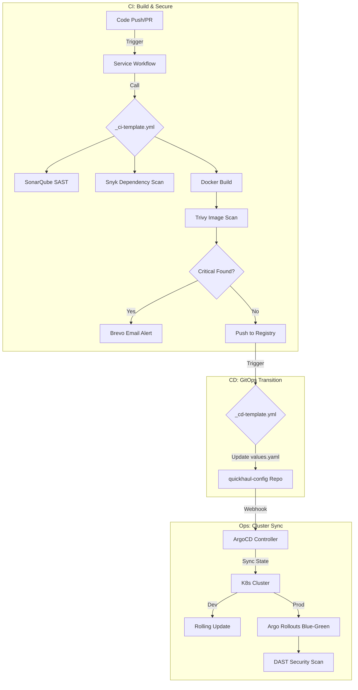

# 🚚 QuickHaul: Enterprise GitOps & CI/CD Framework

Welcome to the **QuickHaul Templates** repository. This is the centralized "Workflow Library" for the QuickHaul ecosystem, providing reusable, enterprise-grade GitHub Action templates for Continuous Integration (CI) and triggering Continuous Deployment (CD).

> [!TIP]
> **New to the project?** Follow the [Detailed Setup Guide (EC2, SonarQube, ArgoCD)](./SETUP_GUIDE.md) to get your infrastructure up and running.

---

## 🏗️ The QuickHaul Ecosystem Architecture

The project is split into three main components to ensure a clean separation of concerns and a robust GitOps workflow:

1.  **Microservice Repositories**: (e.g., `quickhaul-auth`, `quickhaul-booking`) These repositories contain the source code and use the templates in this repo to build and test their applications.
2.  **`quickhaul-templates` (This Repo)**: Centralized logic for CI/CD. Any change here propagates to all microservices, ensuring consistency across the platform.
3.  **[`quickhaul-config`](https://github.com/QuickHaulTransits/quickhaul-config)**: The GitOps **Source of Truth**. It contains Helm charts, ArgoCD Application manifests, and handles the actual deployment to Kubernetes.

---

## 🔄 The CI/CD Lifecycle



---

## 🛡️ Security-First Approach

Our CI/CD pipeline implements security at every stage:
-   **SAST (Static Application Security Testing)**: SonarQube analyzes code for bugs, vulnerabilities, and code smells.
-   **SCA (Software Composition Analysis)**: Snyk checks third-party libraries for known vulnerabilities.
-   **Container Scanning**:
    *   **Trivy** scans every Docker image for OS and library vulnerabilities before push.
    *   Images are pushed to **GHCR (GitHub Container Registry)**.
-   **DAST (Dynamic Application Security Testing)**: OWASP ZAP scans the live production environment after deployment (configured in `quickhaul-config`).
-   **EC2 Infrastructure**: Recommended to run on `t3.medium` instances with `k3s` or `EKS`.

---

## 🛠️ Usage Guide

### Integrating a new Microservice

To use these templates in a new service, create a workflow file at `.github/workflows/pipeline.yml`:

```yaml
name: Production Pipeline

on:
  push:
    branches: [ main ]

jobs:
  # 1. Run CI: Build, Test, and Scan
  ci:
    uses: QuickHaulTransits/quickhaul-templates/.github/workflows/_ci-template.yml@main
    with:
      service-name: "my-service"
      service-path: "./"
      environment: "main"
      runtime: "node" # or "python"
    secrets: inherit # Automatically passes all secrets

  # 2. Run CD: Update GitOps Manifests
  cd:
    needs: ci
    if: github.event_name != 'pull_request'
    uses: QuickHaulTransits/quickhaul-templates/.github/workflows/_cd-template.yml@main
    with:
      service-name: "my-service"
      image-tag: ${{ needs.ci.outputs.tag }}
      environment: "main"
    secrets: inherit
```

---

## 📂 Template Directory Structure

-   `_ci-template.yml`: The main engine for building and scanning microservices.
-   `_cd-template.yml`: Handles the cross-repository update to the GitOps config repo.
-   `_docker-publish.yml`: Specialized workflow for pushing images to registries (DockerHub/GHCR).
-   `_sast.yml` / `_sca.yml`: Modular templates for security scanning.
-   `_notify.yml`: Centralized notification logic (Brevo/Email).

---
*Maintained by the **QuickHaul DevOps Team**. For cluster bootstrapping and deployment manifests, visit the [quickhaul-config](https://github.com/QuickHaulTransits/quickhaul-config) repository.*
